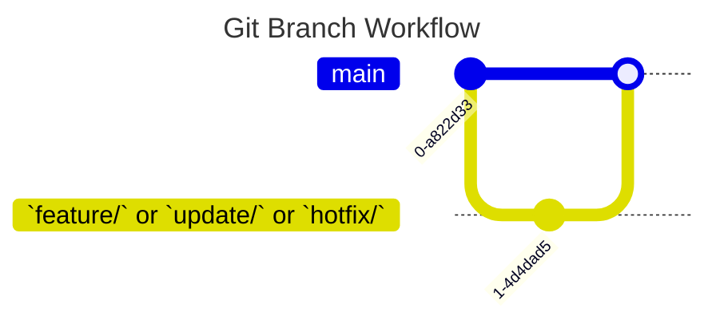

# PsyKi

## Project Setup
### Anleitung Projekt öffnen

1. Auf GitHub gehen:

2. Auf Code (grün) klicken und Art des Clones wählen (z.B. HTTPS)
3. VSCode oder andere IDE öffnen
4. Neues Terminal öffnen und in den gewünschten Ordner navigieren, wo das Projekt liegen soll oder gewünschten Ordner direkt in VSCode öffnen. 
5. Im Terminal in VSCode eingeben: git clone https://github.com/L0i0n0a/PsyKi.git
6. Der Ordner mit den Inhalten sollte in der Hierachie sichtbar sein.
7. In den Ordner multarbeit navigieren im Terminal
8. npm install im Terminal eingeben
9. Dann npm run dev im terminal eingeben, das startet die Anwendung

## Git Practice

