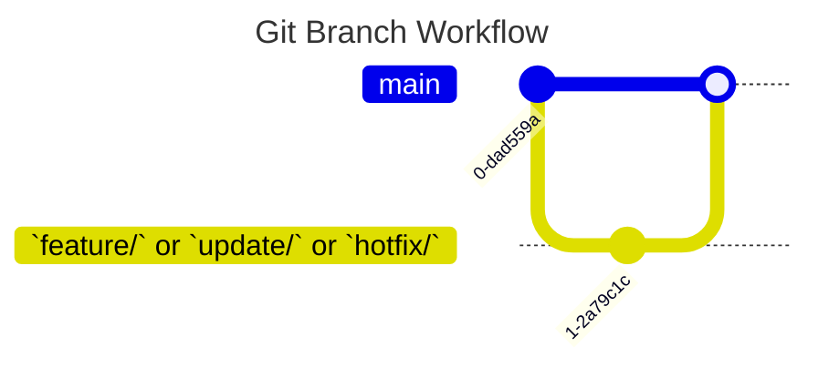

# PsyKi

## Git Practice

```mermaid
---
title: Git Branch Workflow
---
gitGraph
commit
branch "`feature/` or `update/` or `hotfix/`"
commit
checkout main
merge "`feature/` or `update/` or `hotfix/`"
```